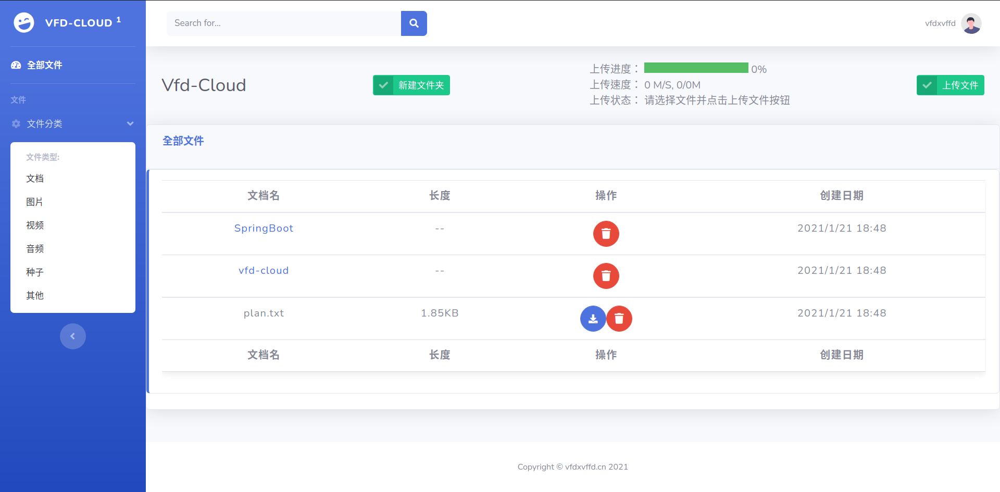

# vfd-cloud

> ​		一个基于SpringBoot的云存储项目，适合新手练手学习，用到的技术栈列到了下面。支持用户的注册登陆及修改密码，利用邮箱进行验证。支持文件上传下载以及删除。支持文件夹的创建删除。

## 二、核心技术栈

### 后端

- SpringBoot2
- MyBatis
- Redis
- RabbitMQ
- MySQL

### 前端

- Html5+Css+JavaScript
- JQuery
- Bootstrap
- Thymeleaf