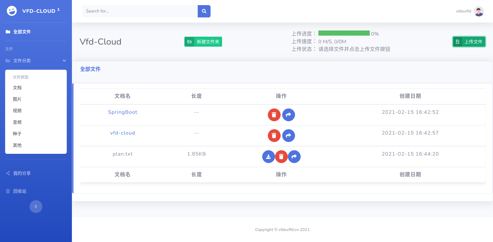

# vfd-cloud

&nbsp;&nbsp;&nbsp;&nbsp;&nbsp;&nbsp;&nbsp;&nbsp;&nbsp;

> ​		一个基于SpringBoot的云存储网盘项目，适合练手学习SpringBoot，用到的技术栈列到了下面。支持用户的注册登陆及修改密码，利用邮箱进行验证。支持文件上传下载以及分享和删除。支持文件夹的创建分享及删除。

- 用户的注册登陆及修改密码，采用邮箱进行验证
- 文件上传下载以及分享和删除
- 文件的分类查找
- 文件夹的创建分享及删除
- 用户登录时记住我功能，以及注销功能
- 文件分享后查看所有分享链接，以及链接的状态，并可以随时取消某个链接的分享

## 一、核心技术栈

### 后端

- SpringBoot2
- MyBatis
- Redis
- RabbitMQ
- MySQL

### 前端

- Html5+Css+JavaScript
- JQuery
- Bootstrap
- Thymeleaf

## 二、项目计划

- [x] 账户信息管理模块
- [x] 文件上传下载删除模块
- [x] 文件夹管理模块
- [x] 文件的加密解密处理模块
- [x] 文件分享模块
- [ ] 管理员对用户的管理模块
- [ ] 文件检索模块
- [ ] 等等其他模块（以后增加）